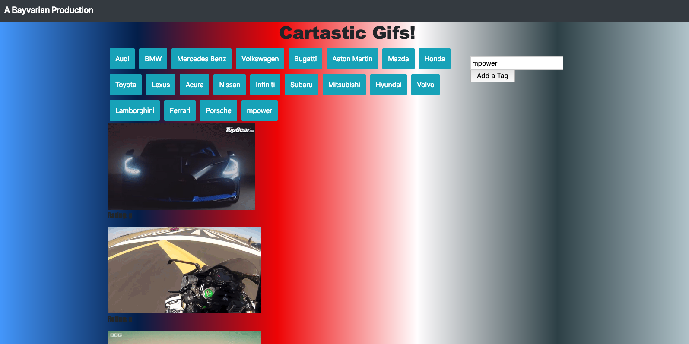

# HW6-Giftastic

## Executive Summary
* Short project showcasing use of APIs via AJAX calls, leveraged combination of popular libraries including jQuery and Bootstrap. 
[Link to Github Pages](https://bavarianstance.github.io/hw6-giftastic/ "Giftastic Widget")

## Technologies Used
* HTML
* CSS
* Animate.CSS
* Bootstrap V4+
* reset.css
* Javascript ES5
* jQuery
* AJAX API calls

### Comments
* ES6 syntax caused errors when combined with jQuery ES5 syntax, refactored.
* Added edge case to prevent adding of blank tags
* Added edge case to prevent adding of duplicate tags
* Added offset to API call with random integer to randomize search results (removed as it was causing CORS Access Control error intermittently)
* Added Linear Gradient Background Color in BMW //M colors

### Screenshot
